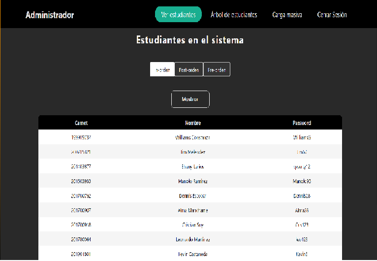
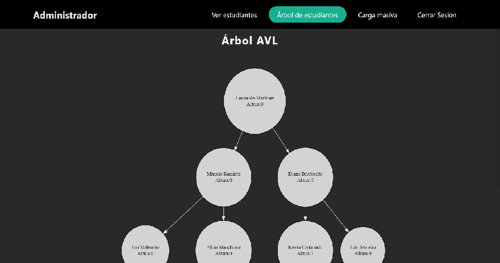
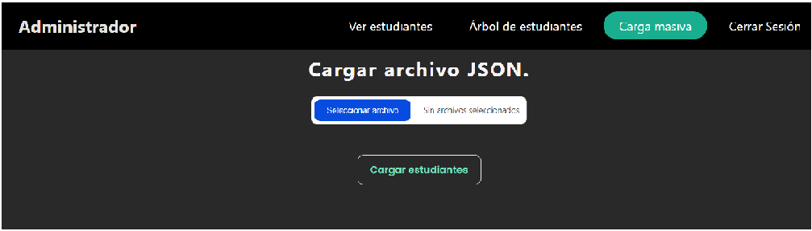
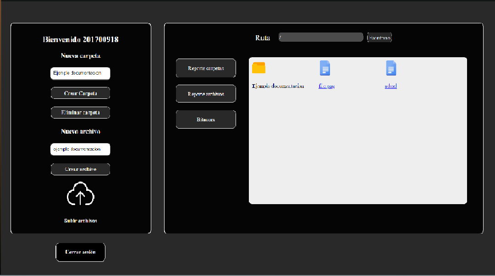
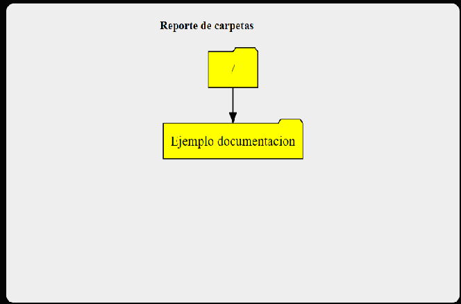
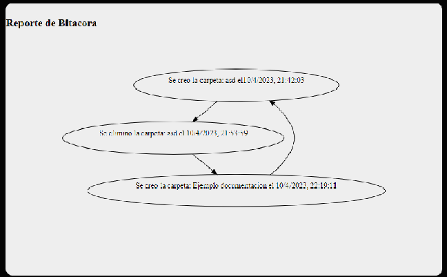

# Proyecto EDD FASE 2

## Autor

- [@Christopher Monterroso](https://www.github.com/ChristopherMonterroso)

## Contenido

- Manual técnico

- Manual de usuario

## Manual técnico

## Login
Funciones para manejar el login

        let avlTree = new AvlTree();
Se declara la variable global en la que se maneja la información de localsotrage.

        if(localStorage.getItem("avlTree")){
            avlTree.root=JSON.parse(localStorage.getItem("avlTree")).root
        }
Sí ya hay información en localStorage se manda a la variable avlTree para ser ordenada

        function authenticateUser() {

            var user = document.getElementById("username").value;
            var password = document.getElementById("password").value;
            let authenticateData={
                "user":user,
                "password":password
            }
            if (user == "admin" && password == "admin") {
            
                localStorage.setItem("authenticateData",JSON.stringify( authenticateData));
                localStorage.setItem("authenticateToken",true)

                Label.textContent = "";
                openAdminPage()
                
            } else if (user == "clear" && password == "clear") {
                localStorage.clear()
                Label.textContent = "";
            } else if (avlTree.authenticate(user,password)) {
                localStorage.setItem("authenticateData",JSON.stringify( authenticateData));
                Label.textContent = "";
                window.location.replace("user.html")
                
            } else {
                Label.textContent = "*Datos incorrectos*";
            } 
                

        }
Esta función verifica el usuario y contraseña, si es admin en los dos casos entra al perfil del administrador y en dado caso de no reconocer las credenciales mostrara una mensaje de datos incorrectos.

        function openAdminPage() {

            window.location.replace("admin.html")
        }
Esta función abre la ventana del administrador.

## Administrador

Funciones para mostrar la información dentro del administrador.

    let avlTree = new AvlTree();

Se declara la variable avlTree para manejar la información. 

    function loadStudentsForm(event) {
        event.preventDefault();
        
        const inputFile = document.getElementById('inputFile');
        const file = inputFile.files[0];
        let studentsArray = [];
        
        try {
            let reader = new FileReader();

            reader.readAsText(file);
            reader.onload = () => {

                studentsArray = JSON.parse(reader.result).alumnos;
                
                $('#table tbody').html(
                    studentsArray.map((item, index) => {
                        return (`
                            <tr>
                                <td data-th="Carnet">${item.carnet}</td>
                                <td data-th="Nombre">${item.nombre}</td>
                                <td data-th="Password">${item.password}</td>
                            </tr>
                        `);
                    }).join('')
                )
                
                for (let i = 0; i < studentsArray.length; i++) {
                    let item={
                        carnet:studentsArray[i].carnet,
                        nombre:studentsArray[i].nombre,
                        password:studentsArray[i].password,
                        carpeta_raiz:studentsArray[i].carpeta_raiz
                    }
                    avlTree.insert(item);
                }
                // GUARDAR EN LOCAL STORAGE
                localStorage.setItem("avlTree", JSON.stringify(avlTree))
                alert("Estudiantes cargados")
                
            }
        } catch (error) {

            console.log(error);
            alert("Error en la inserción");
        }

    }
En esta función se cargan los archivos que se hayan cargado, los muestra en tabla y los guarda en localStorage.

Estructuras de datos utilizadas:
        
- ARBOL AVL
    
    En esta estructura se encuentran almacenados los estudiantes y se almacenan dentro de sus nodos las estructuras: lista ciruclar, árbol multicaminos y matriz dispersa.
    
    Tiene las funciones de mostrar en tabla y de forma gráfica los estudiantes.

        class AvlNode {
            constructor(item) {
            this.item = item;
            this.left = null;
            this.right = null;
            this.height = 0;
            }
        }
        let = nodes = "";
        let = connections = "";

        class AvlTree {
            constructor() {
            this.root = null;
        }

        insert(item){
            this.root = this.#insertRecursive(item, this.root);
            this.getHeight(this.root)
            this.root=this.checkBalance(this.root)
        }
        #insertRecursive(item, node){
            if(node==null){
                node=new AvlNode(item)
            }else if(item.carnet<node.item.carnet){
                //left
                node.left=this.#insertRecursive(item,node.left)

            }else if(item.carnet>node.item.carnet){
                //right
                node.right=this.#insertRecursive(item,node.right)
            }
            return node
        }
        getHeight(node){
            node.height=0
            var heightRight=0
            var heightLeft=0
            if(node.left){
                heightLeft-=this.getHeight(node.left)
            }
            if(node.right){
                heightRight+=this.getHeight(node.right)
            }
            node.height=heightRight+heightLeft

            return Math.max(heightRight, Math.abs(heightLeft))+1
        }
        checkBalance(node){
            if(node.left){
                node.left = this.checkBalance(node.left)
            }
            if(node.right){
                node.right=this.checkBalance(node.right)
            }
            this.getHeight(this.root)
            if(node.height>1 || node.height<-1){
                node = this.balancear(node)
                this.getHeight(this.root)
                node=this.checkBalance(node)
            }
            return node
        }
        balancear(parent){
            if(parent.height>1 && parent.right && (parent.right.height>1||parent.right.height<-1)){
                parent.right = this.balancear(parent.right)
            }else if(parent.height<-1 && parent.left && (parent.left.height<-1||parent.left.height>1)){
                parent.left = this.balancear(parent.left)
            }else if(parent.height<0 &&parent.left.height===-1){
                if(parent.left.right){
                    var saveRight = parent.left.right
                }
                if(parent.left.left){
                    var saveLeft =parent.left.left
                }
                parent.left.right = new AvlNode(parent.item)
                parent.left.right.right=parent.right
                parent =parent.left
                parent.right.left=saveRight
                parent.left =saveLeft
            }else if(parent.height<0 &&parent.left.height===1){
                if(parent.left.right.left){
                    var saveLeft = parent.left.right.left
                }if(parent.left.right.right){
                    var saveRight = parent.left.right.right
                }
                parent.left.right.right = new AvlNode(parent.item)
                parent.left.right.right.right = parent.right
                parent.left.right.left = new AvlNode(parent.left.item)
                parent.left.right.left.left=parent.left.left
                parent =parent.left.right
                parent.left.right = saveLeft
                parent.right.left = saveRight
            }else if(parent.height>0 &&parent.right.height===1){
                if(parent.right.left){
                    var saveLeft =parent.right.left
                }if(parent.right.right){
                    var saveRight = parent.right.right
                }
                parent.right.left = new AvlNode(parent.item)
                parent.right.left.left =parent.left
                parent = parent.right
                parent.left.right = saveLeft
                parent.right=saveRight

            }else if(parent.height>0 &&parent.right.height===-1){
                if(parent.right.left.right){
                    var saveRight = parent.right.left.right
                }
                if(parent.right.left.left){
                    saveLeft=parent.right.left.left
                }
                parent.right.left.left = new AvlNode(parent.item)
                parent.right.left.right = new AvlNode(parent.right.item)
                parent.right.left.right.right=parent.right.right
                parent.right.left.left.left = parent.left
                parent =parent.right.left
                parent.right.left = saveRight
                parent.left.right =saveLeft
            }

            return parent
        }
    
        authenticate(user,password){
            this.current = this.root
            return this.#authenticateRecursive(user,password)
        }

        #authenticateRecursive(user,password){
            if(this.current && this.current.item.carnet.toString()===user && this.current.item.password===password){
                return this.current
            }else if( this.current && this.current.item.carnet<user){
                this.current = this.current.right
                return this.#authenticateRecursive(user,password)
            }else if(this.current && this.current.item.carnet>user){
                this.current = this.current.left
                return this.#authenticateRecursive(user,password)
            }
            return false
        }
        save(user,password,Binnacle,nAry){
            this.current = this.root
            return this.#saveRecursive(user,password,Binnacle,nAry)
        }
        #saveRecursive(user,password,Binnacle,nAry){
            if(this.current && this.current.item.carnet.toString()===user && this.current.item.password===password){
                this.current.circularList=Binnacle
                this.current.nAryTree=nAry
                return this.current
            }else if( this.current && this.current.item.carnet<user){
                this.current = this.current.right
                return this.#saveRecursive(user,password,Binnacle,nAry)
            }else if(this.current && this.current.item.carnet>user){
                this.current = this.current.left
                return this.#saveRecursive(user,password,Binnacle,nAry)
            }
            return false
        }

        treeGraph(){
            nodes = "";
            connections = "";
            if(this.root!=null){
                this.#treeGraphRecursive(this.root);
            }

            return nodes + connections;
        }
        #treeGraphRecursive(current){
            if(current.left != null){
                this.#treeGraphRecursive(current.left);
                connections += `S_${current.item.carnet} -> S_${current.left.item.carnet} [color="white"];\n`;
            }
            nodes += `S_${current.item.carnet}[label="${current.item.nombre}\\nAltura:${current.height}"  style=filled];`
            if(current.right != null){
                this.#treeGraphRecursive(current.right);
                connections += `S_${current.item.carnet} -> S_${current.right.item.carnet} [color="white"];\n`;
            }
        }
        

        inOrder() {
            let html = this.#inOrderRecursive(this.root);
            return html;
        }
        #inOrderRecursive(current) {
            let row = "";
            if (current.left != null) {
                row += this.#inOrderRecursive(current.left);
            }
            row += `
                <tr>
                    <td data-th="Carnet">${current.item.carnet}</td>
                    <td data-th="Nombre">${current.item.nombre}</td>
                    <td data-th="Password">${current.item.password}</td>
                </tr>
            `;
            if (current.right != null) {
                row += this.#inOrderRecursive(current.right);
            }
            return row;
        }

        preOrder() {
            let html = this.#preOrderRecursive(this.root);
            return html;
        }
        #preOrderRecursive(current) {
            let row = "";
            row += `
                <tr>
                    <td data-th="Carnet">${current.item.carnet}</td>
                    <td data-th="Nombre">${current.item.nombre}</td>
                    <td data-th="Password">${current.item.password}</td>
                </tr>
            `;
            if (current.left != null) {
                row += this.#inOrderRecursive(current.left);
            }
            if (current.right != null) {
                row += this.#inOrderRecursive(current.right);
            }
            return row;
        }

        postOrder() {
            let html = this.#postOrderRecursive(this.root);
            return html;
        }
        #postOrderRecursive(current) {
            let row = "";
            if (current.left != null) {
                row += this.#inOrderRecursive(current.left);
            }
            if (current.right != null) {
                row += this.#inOrderRecursive(current.right);
            }
            row += `
                <tr>
                    <td data-th="Carnet">${current.item.carnet}</td>
                    <td data-th="Nombre">${current.item.nombre}</td>
                    <td data-th="Password">${current.item.password}</td>
                </tr>
            `;
            return row;
            }

        }

- Lista circular:

    En esta estructura se encuentran almacenadas las bitacoras de los usuarios con las función para graficarla.

        class Node {
        constructor(item,user){
            this.item = item;
            this.nextNode = null;
            this.user=user;
            
            }
        }
            let  nodes = "";
            let  connections = "";

        class CircularList {
        constructor() {
            this.root = null;
            this.last = null;
            this.size=0;
        }

        insert(item){
            this.root=this.#insertRecursive(item,this.root)
        }
        #insertRecursive(item, node){
            if(node==null){
                node=new Node(item,this.size)
                this.last=node
            }else {
                let current=node
                while (current.nextNode!=null){
                    current=current.nextNode
                }
                current.nextNode=new Node(item,this.size)
                this.last=current.nextNode
            }
            this.size=this.size+1
            return node
        }
        Graph(){
            nodes = "";
            connections = "";
            if(this.root!=null){
                this.#GraphRecursive(this.root);
                try {
                    if(this.last.user!==this.root.user){
                        connections += `S_${this.last.user} -> S_${this.root.user} ;\n`;
                    }
                }catch (e){

                }

            }
            // console.log(nodes,connections);
            return nodes + connections;
        }

        #GraphRecursive(current) {
            nodes += `S_${current.user}[label="${current.item.msg}\\n " ];\n`
            if(current.nextNode!= null){
                this.#GraphRecursive(current.nextNode);
                connections += `S_${current.user} -> S_${current.nextNode.user} ;\n`;
                }

            }
        }

- Arbol multicaminos

    En esta estructura se encuentran almacenadas las carpetas y archivos de los estudiantes y la función para almacenarla en el escritorio y mostrar el reporte de las mismas.

        class nodeNA {

            constructor(folderName) {
                this.folderName = folderName;
                this.files = [];
                this.children = []; // TODOS LOS NODOS HIJOS
                this.id = null; // PARA GENERAR LA GRÁFICA
            }
        }
        class nAryTree {
            constructor() {
                this.root = new nodeNA('/');
                this.root.id = 0;
                this.size = 1; // Para generar los ids
                this.repeat = 0;
            }

            insert(folderName, fatherPath) {
                let fatherNode = this.getFolder(fatherPath);
                if (fatherNode) {
                    folderName = this.repeatFolder(folderName, fatherNode)
                    let newNode = new nodeNA(folderName);
                    this.size += 1;
                    newNode.id = this.size;
                    fatherNode.children.push(newNode);
                } else {
                    console.log("Ruta no existe");
                }
                return folderName
            }
            delete(folderName, fatherPath) {
                let key = false
                let fatherNode = this.getFolder(fatherPath);
                if (fatherNode) {
                    fatherNode.children.forEach(child => {
                        if (folderName.toString() === child.folderName) {
                            const id = fatherNode.children.findIndex(node => node.folderName === folderName)
                            fatherNode.children.splice(id, 1)
                            key = true
                        }
                    })
                } else {
                    console.log("Ruta no existe");
                }
                return key
            }

            getFolder(path){
                // Padre sea una '/'
                // console.log(path);
                if(path == this.root.folderName){
                    return this.root;
                }else{
                    let temp = this.root;
                    let folders = path.split('/');
                    folders = folders.filter( str => str !== '');
                    let folder = null;
                    while(folders.length > 0){
                        let currentFolder = folders.shift()
                        folder = temp.children.find(child => child.folderName == currentFolder);
                        if(typeof folder == 'undefined' || folder == null){
                            return null;
                        }
                        temp = folder;
                    }
                    return temp;
                }
            }

            repeatFolder(folderName,fatherNode){
                this.repeat=0;
                if(fatherNode.children.length>0){
                    return this.repeatFolderRecursive(folderName,fatherNode)
                }
                return folderName
            }
            repeatFolderRecursive(folderName,fatherNode){
                if(fatherNode.children.length>0) {
                    fatherNode.children.forEach(child => {
                        if(folderName.toString()===child.folderName){
                            const regex = /\(\d+\).*/;
                            const indice = folderName.search(regex);
                            if (indice >= 0) {
                                folderName = folderName.replace(regex, "")
                            }
                            this.repeat+=1
                            folderName=folderName+"("+this.repeat+")"
                            folderName= this.repeatFolderRecursive(folderName,fatherNode)
                        }
                    })
                }
                return folderName
            }
            repeatFile(fileName,List){
                this.repeat=0;
                if(List.length>0){
                    return this.repeatFileRecursive(fileName,List)
                }
                return fileName
            }
            repeatFileRecursive(folderName,List){
                if(List.length>0) {
                    List.forEach(child => {
                        if(folderName.toString()===child.name){
                            const regex = /\(\d+\).*/;
                            const indice = folderName.search(regex);
                            if (indice >= 0) {
                                folderName = folderName.replace(regex, "")
                            }
                            this.repeat+=1
                            folderName=folderName+"("+this.repeat+")"
                            folderName= this.repeatFileRecursive(folderName,List)
                        }
                    })
                }
                return folderName
            }

            graph() {
                let nodes = "";
                let connections = "";

                let node = this.root;
                let queue = [];
                queue.push(node);
                while (queue.length !== 0) {
                    let len = queue.length;
                    for (let i = 0; i < len; i++) {
                        let node = queue.shift();
                        nodes += `S_${node.id}[label="${node.folderName}" style=filled,fillcolor="yellow", shape=folder];\n`;
                        node.children.forEach(item => {
                            connections += `S_${node.id} -> S_${item.id} [color="black"];\n`
                            queue.push(item);
                        });
                    }
                }
                return 'node[shape="record"];\n' + nodes + '\n' + connections;
            }

            searchFile(name) {
                let node = this.root
                return this.searchFileRecursive(name, node)
            }
            searchFileRecursive(name, node) {
                let key = false
                if (node.files.map(file => {
                    if (file.name === name) {
                        key = true
                    }
                })
                ) {
                    if (key) {
                        return true
                    }
                } else {
                    node.children.map(child => {
                        this.searchFileRecursive(name, child)
                    })
                }

                return false
            }

            getHTML(path) {
                let node = this.getFolder(path);
                let code = "";
                node.children.map(child => {
                    code += ` 

                                
                                
${child.folderName}

                            
`
                })
                // console.log(node.files)
                node.files.map(file => {
                    if (file.type === 'text/plain') {
                        let archivo = new Blob([file.content], {type:file.type});
                        const url = URL.createObjectURL(archivo);
                        code += `
                                

                                
                                

                                    <a href="${url}" download>
                                        ${file.name}
                                    </a>
                                

                            

                        `
                    } else {
                        code += ` 

                                
                                

                                    <a href="${file.content}" download>
                                        ${file.name}
                                    </a>
                                

                            
`
                    }
                })
                return code;
            }
        }
## Manual de usuario

- Login:

    Ventana principal en la cual el administrador o usuario puede acceder a su perfil.

    

- Dashboard administrador
    
    En esta ventana se carga de forma predeterminada los usuarios en el sistema mostrados en una tabla en la cual se puede elegir el orden en el cual se desea ver, también se puede visualizar el árbol AVL de los estudiantes y hacer una carga masiva

    

    

    

- Dashboard estudiantes

    En el apartado de los usuarios tenemos las opciones de crear carpetas y almacenar archivos dentro o fuera de las carpetas con un apartado para crear o subir los archivos y con la función de generar reportes de cada una de las funciones anteriores además de ver las bitacoras de las acciones del usuario.

     

     

     

     

