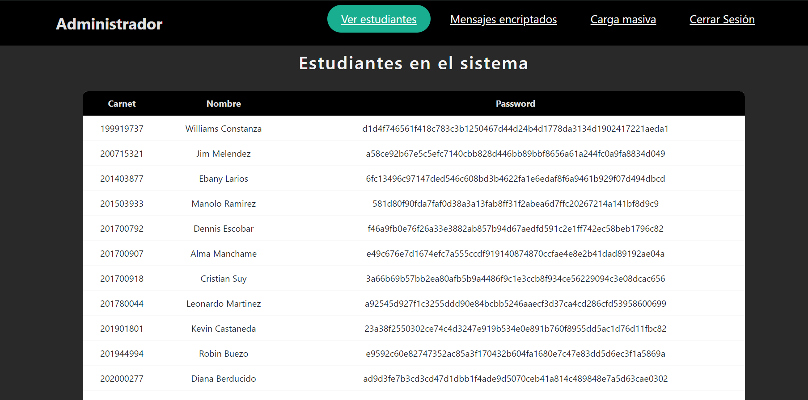
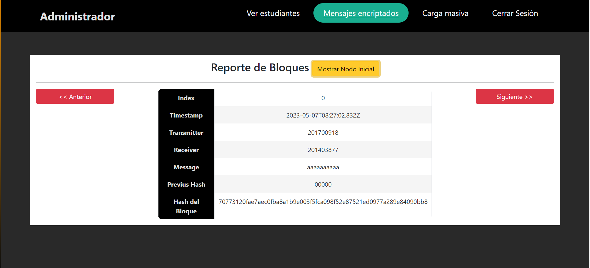

# Proyecto EDD FASE 2

## Autor

- [@Christopher Monterroso](https://www.github.com/ChristopherMonterroso)

## Contenido

- Manual de usuario

## Manual de usuario

- Login:

    Ventana principal en la cual el administrador o usuario puede acceder a su perfil.

    

- Dashboard administrador
    
    En esta ventana se carga de forma predeterminada los usuarios en el sistema mostrados en una tabla con la contraseña encriptada, también se puede visualizar los mensajes encriptados y hacer una carga masiva

    

    

    

- Dashboard estudiantes

    En el apartado de los usuarios tenemos las opciones de crear carpetas y almacenar archivos dentro o fuera de las carpetas con un apartado para crear o subir los archivos y con la función de generar reportes de cada una de las funciones anteriores, también se tiene un apartado con un chat donde se pueden comunicar entre estudiantes.

     

     

     

     
 

